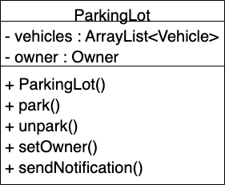
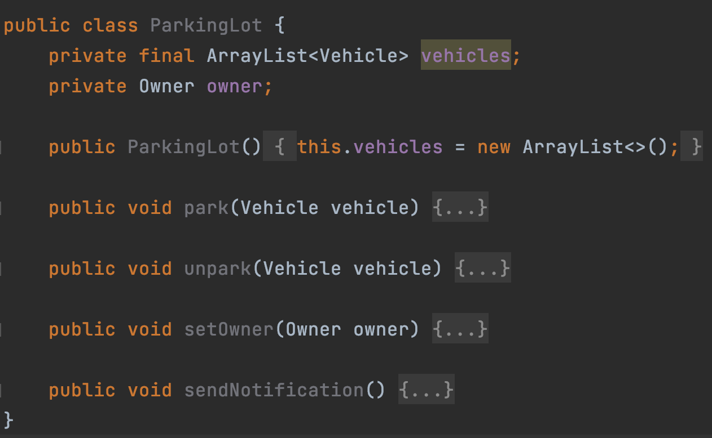
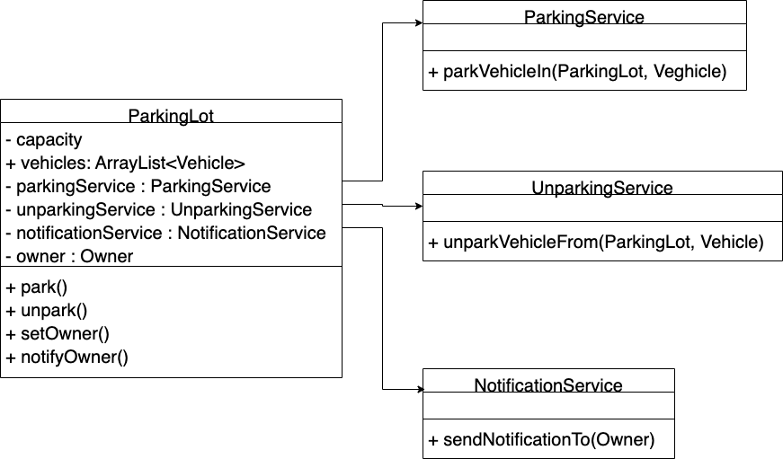

# Single Responsibility Principle

## Example (ParkingLot):

- There is a parking lot, where different kinds of vehicles used to park and unpark.
- The vehicles can be able to park and unpark based on the capacity of the parking lot.
- The owner of the parking lot can be changed based on the auction.
- When the slots of the parking lot are full, then the owner should be able to notify.

## Approach without Single Responsibility Principle

### UML:

### Code:

## Issues with the above approach

- Have to change the class, if the parking and unparking has to be changed.
- The class would be modified again, if the selection logic of the owner needs to change.
- Need to change the class, when notification medium changes to another type.
- The more responsibilities class has, the more often you need to change it.

## UML with Single Responsibility Principle

